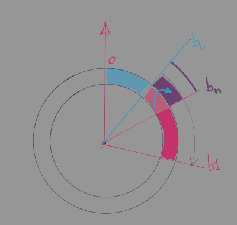
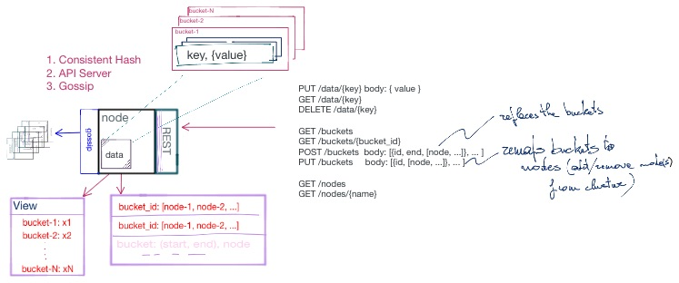
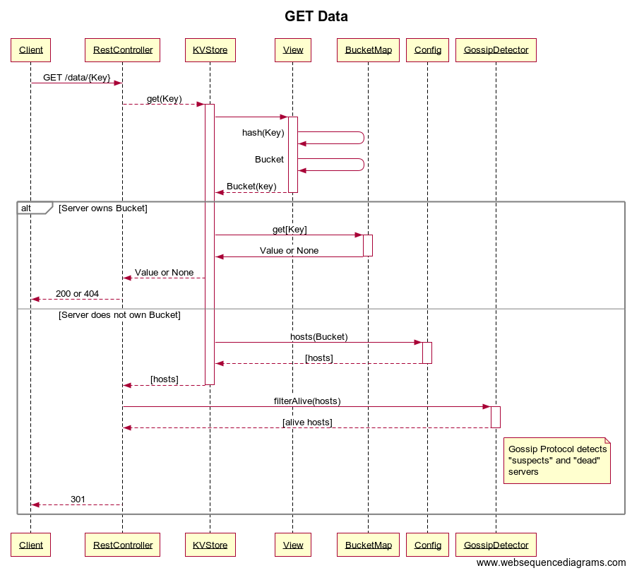

# libdist - C++ utilities for Distributed Computing

Project   | [distlib](https://bitbucket.org/marco/distlib)
:---      | ---:
Author    | [M. Massenzio](https://bitbucket.org/marco)
Version   | 0.19.0
Updated   | 2020-12-30
Issues    | [Jira](https://kapsules.atlassian.net/secure/RapidBoard.jspa?rapidView=1&projectKey=DIST)


[](https://opensource.org/licenses/Apache-2.0)


# Motivation

This is a collection of C++ advanced building blocks to implement distributed systems; they are mostly meant to learn about advanced algorithms, or modern C++ (up to C++17, currently) features.

A detailed description of the library's features follows the [Install & build](#install_build) section, in [Projects](#projects); more details about the theory (where applicable) can be found in the papers cited in the [References](#references).

# Install & Build

## Build & testing

### Common utilities

The build/test scripts in this repository take advantage of shared common utility functions in [this common utils repository](https://bitbucket.org/marco/common-utils): clone it
somewhere, and make `$COMMON_UTILS_DIR` point to it:

```shell
git clone git@bitbucket.org:marco/common-utils.git
export COMMON_UTILS_DIR="$(pwd)/common-utils"
```

To build/test the project, link to the scripts there:

```shell
ln -s ${COMMON_UTILS_DIR}/build.sh build && \
    ln -s ${COMMON_UTILS_DIR}/test.sh test
```

### Build & Install libdistutils.so

The CMake build requires `INSTALL_DIR` to be defined:

```shell script
$ export INSTALL_DIR=/some/path
$ ./bin/build && ./bin/test
```

or to simply run a subset of the tests with full debug logging:

    $ ./bin/test -v --gtest_filter="Bucket*"     

To install the generated binaries (`.so` or `.dylib` shared libraries) and headers so that other projects can find them:

    $ cd build && make install

See the scripts in the `${COMMON_UTILS_DIR}` folder for more options.

## API Documentation

All the classes are documented using [Doxygen](http://www.doxygen.nl/), just run:

    $ doxygen

from the main project directory and all apidocs will be generated in `docs/apidocs/html`; to view them open `index.html` in your browser:

    # In Linux use xdg-open; on MacOS:
    open docs/apidocs/html/index.html

### Run the examples

Example sources that shows how to use consistent hashes, build a Merkle tree or create a distributed Key/Value store are in the `src/examples` folder, and will be built into the `build/bin` output directory.

After [building](#build-libdist) the project, you can run it with:

    ./build/bin/merkle_demo  "some string to hash" 8

## Conan packages

This project use [Conan](https://conan.io) to build dependencies; please see [this post](https://medium.com/swlh/converting-a-c-project-to-cmake-conan-61ba9a998cb4) for more details on how to use inside a CMake project.

To build the project, you need to first download/build the necessary binary dependencies, as listed in `conanfile.txt`.

After the dependencies are built, you can see information about them using `conan info build` (the commands above assume that `clang` is configured on the `PATH` and that you have version `$VERSION` installed).

See also `CMakeLists.txt` for the changes necessary to add Conan's builds to the targets.

See [conan.io](http://conan.io) for more information.


# Projects

## Argument Parser

Parsing the CLI arguments passed in to a C++ program has always been rather laborious (and, let's face it, tedious); [`utils::ParseArgs`](https://bitbucket.org/marco/distlib/src/develop/include/utils/ParseArgs.hpp#lines-109) simplifies the task (taking inspiration from Python's `argparse` module) by allowing to retrieve simply the values of options passed in via something like:

    ./keystore --threads=5 --buckets=7 --verbose

with something as simple as:

```
int main(int argc, const char **argv) {

  ::utils::ParseArgs parser(argv, argc);

  FLAGS_v = parser.Enabled("verbose") ? 2 : 0;
  FLAGS_logtostderr = parser.Enabled("verbose");

  int buckets = parser.GetInt("buckets", 5);
  int partitions = parser.GetInt("partitions", 10);
  long inserts = parser.GetInt("values", 1000000);
  long num_threads = parser.GetInt("threads", 5);

  // ...
```

`ParseArgs` allows the use of string, numeric and boolean (flag) arguments and provides a number of convenience methods to parse `host:port` and IP addresses patterns, as well as providing "array" options as a list of comma-separated values.

See the [generated `doxygen`](#api-documentation) for details.


## Merkle Trees

A Merkle Tree is a tree structure where the individual nodes’ hashes are computed and stored in the parent node, so that the hash stored in the root node is the only value that is required to later validate the contents of the tree (stored in the leaves).

Merkle trees are used in the Blockchain and are described in greater detail in "[Mastering bitcoin](https://amzn.to/32B4jYE)" (Chapter 7, “Merkle Trees”):

See [this post](https://codetrips.com/2016/06/19/implementing-a-merkle-tree-in-c/) for more details.


## Consistent Hashing

A "consistent hash" is one that remains "stable" in the face of addition/removal of buckets, where "stable" is taken to mean here that the fraction of data (key/values) that need to be reallocated is a small fraction of the overall data stored.

<center>


<br><small>Add Bucket</small></center><br>

When we add bucket `b`<sub>n</sub> only the fraction of keys whose hashes fall between the `partition point` of `b`<sub>0</sub> and `b`<sub>n</sub>'s need to be moved out of the node which contains the keys that hash to `b`<sub>1</sub>.

If, for simplicity, we assume that each bucket maps to a server node, then only the two servers who respectively serve `b`<sub>1</sub> and `b`<sub>n</sub> will need to exchange data (from `1` to `n`), while all the others will remain unchanged.

See the [Consistent Hash paper](http://www.cs.princeton.edu/courses/archive/fall07/cos518/papers/chash.pdf) for more details.

The code implementation here is a simple example of how to implement a set of `buckets` so that nodes in a distributed systems could use the consistent hashing algorithm to allow nodes to join/leave the ring, without causing massive reshuffles of the partitioned data.

A `View` is then a collection of `Buckets`, which define how the unity circle is divided, via the `consistent_hashing()` method and every partitioned item is allocated to a (named) `Bucket`: see the [tests](tests/test_view.cpp) for an example of adding/removing buckets and how this only causes a fraction of the items to be re-shuffled.

An example of how this can be used to implement an in-memory KV store is presented [below](#key_value-store) and further enhanced (across nodes in a network) [here](https://bitbucket.org/marco/distkvs).

Notably, [Apache Cassandra](https://cassandra.apache.org/) uses consistent hashing to reduce volume of data shuffles when nodes are added/removed from the ring.


## Key/Value Store

This is an in-memory implementation of a distributed Key-Value Store, which partitions its keys according to a [Consistent Hash](#consistent-hashing) scheme (see the [References](#references) for the original paper).

This is how this could be used to implement a distributed KV Store, where each Node is assigned responsibility for a subset of the overall collection of buckets:



A replication scheme (to increase durability and failure resistance) could be implemented by assigning each bucket to several nodes and having a strategy for propagating each data-modifying request (a `Put` or a `Remove`) appropriately.

<center>


<br><small>Get Key</small></center><br>


During a `PUT`, a very similar process is followed, only the KV Store itself takes care of forwarding the write request to an appropriate node, if the key belongs to a bucket that is not under its purview; the response will contain a `Location` header pointing to the correct *node* for subsequent `GET` requests (however, we do not expect clients to cache `{Key, Node}` associations; that is an optimization that is optionally available to clients).

### Rebalancing

As noted [above](#consistent-hashing), only a subset of keys need to be relocated when a bucket is added to the KV Store; the algorithm then, is relatively straightforward:

1. For each partition point (`p`<sub>j</sub>) in `b`<sub>n</sub>', determine the bucket `b`<sub>j</sub> where it falls;

2. Scan all the keys in `b`<sub>j</sub>; and

3. For each `k`<sub>i</sub> whose hash falls into `b`<sub>n</sub>, move the data to `b`<sub>n</sub>.

Note that for step #3, as we already know that the `k`<sub>i</sub>'s hash falls into (the original) `b`<sub>j</sub>, all we need to check is whether<br><br>
`hash(k`<sub>i</sub>`) < p`<sub>j</sub><br><br>
to confirm that the data needs moving.

Given that there is no way to predict where each key's will hash, we need to scan **all** the keys in `b`<sub>1</sub>, so this algorithm is `O(n)` with respect to the bucket's data size.

Removing a node/bucket from the system is even simpler: simply scan all the keys in `b`<sub>n</sub> and move the data to the (one) bucket where they will belong going forward (this is automatically taken care by the system, once the `View` is updated, so no special preparation is needed).

See [the code here](https://bitbucket.org/marco/distlib/src/develop/include/keystore/InMemoryKeyStore.hpp#lines-263) for the implementation.

### Performance

The KeyValue store is thread-safe, so it can be accessed by multiple threads; the actual level of parallelism is the number of buckets: one in-memory Map is associated with each Bucket, and each one of them is protected by a `shared_mutex`, which allows for the "single-writer / multiple-readers" concurrency pattern.

At present, **there is little to no performance optimization**; the `keystore-demo` binary runs some very naive (and write-intensive) basic time estimates:

```
$ ./build/bin/keystore_demo --threads=1 --buckets=5

It took 2997 msec to insert 1000000 values;
  of those 0 were not in scope.

It took 5 msec to lookup 1000 values;
  of those 1000 were successfully found


$ ./build/bin/keystore_demo --threads=6 --buckets=5

It took 1152 msec to insert 1000000 values;
  of those 4 were not in scope.

It took 3 msec to lookup 1000 values;
  of those 1000 were successfully found


$ ./build/bin/keystore_demo --threads=12 --buckets=5

It took 1120 msec to insert 1000000 values;
  of those 4 were not in scope.

It took 2 msec to lookup 1000 values;
  of those 1000 were successfully found


$ ./build/bin/keystore_demo --threads=12 --buckets=12

It took 790 msec to insert 1000000 values;
  of those 4 were not in scope.

It took 2 msec to lookup 1000 values;
  of those 1000 were successfully found
```

As mentioned, the "demo" is very write-intensive, so the gain of using a `shared_mutex` is limited to non-existent; in real-life usage, we would expect a much greater performance gain, even when the concurrent threads vastly outnumber the number of buckets.

`TODO`
We plan to further optimize the hashing/lookup part of the code (it currently is implemented according to the original paper, using `float` hashes: using 32-bit integers we expect a large positive impact, with virtually no implementation downside).


# References

1. [Consistent Hash paper](http://www.cs.princeton.edu/courses/archive/fall07/cos518/papers/chash.pdf)

2. [Mastering bitcoin](https://amzn.to/32B4jYE)

3. [SWIM Protocol](https://www.cs.cornell.edu/projects/Quicksilver/public_pdfs/SWIM.pdf)

4. [Gossip Protocol-based Failure-resistant Failure detectors](https://bitbucket.org/marco/gossip/src/develop/)

5. [Anna KeyValue Store](https://dsf.berkeley.edu/jmh/papers/anna_ieee18.pdf)
