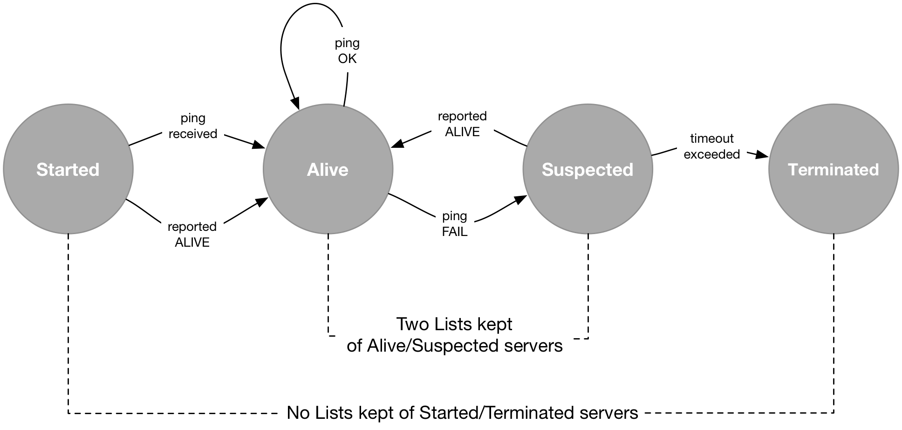

# libdist - C++ utilities for Distributed Computing 


 distlib| 0.6.1
:-------|---------------------------------:
Author  | [M. Massenzio](https://www.linkedin.com/in/mmassenzio)
Updated | 2017-06-19


[](http://www.conan.io/source/cryptopp/5.6.3/riebl/testing)

[](http://www.conan.io/source/glog/0.3.4/dwerner/testing)

[](http://www.conan.io/source/gtest/1.8.0/lasote/stable)

[](http://www.conan.io/source/libzmq/4.1.5/memsharded/stable)

[](http://www.conan.io/source/OpenSSL/1.0.2j/lasote/stable)

[](http://www.conan.io/source/Protobuf/2.6.1/memsharded/testing)


# Install & Build

## Conan package

See [http://conan.io](http://conan.io) for more information.

TO build the project, you need to first donwload/build the necessary binary dependencies, as
listed in `conanfile.text`.

This is done as follows:

```bash
$ sudo -H pip install -U conan
$ mkdir .conan && cd .conan
$ conan install .. -s compiler=clang -s compiler.version=3.6 \
    -s compiler.libcxx=libstdc++11 --build=missing
```

__note__
>I've found Conan not to work terribly well inside virtualenvs - but
if you can make it work there, that'd be the preferred way.

After the dependencies are built, you can see information about them using `conan info ..`
(the commands above assume that `clang` is configured on the `PATH` and that you have
version 3.6 installed).

See also `CMakeLists.txt` for the changes necessary to add Conan's builds to the targets.


### Google Protocol Buffers

The [SWIM gossip protocol implementation](#swim_gossip_and_consensus_algorithm) makes use of
Protobuf as the serialization protocol to exchange status messages between servers.

The code in this project has been tested using
[Protocol Buffers 2.6.1](https://github.com/google/protobuf/releases/tag/v2.6.1), 
installed via Conan's [Protobuf 2.6.1](https://conan.io/source/Protobuf/2.6.1/memsharded/testing) 
package.


## Build & testing

To build the project, it is the usual `cmake` routine:

    $ mkdir build && cd build
    $ cmake -DINSTALL_DIR=${INSTALL_DIR} \
            -DCMAKE_CXX_COMPILER=/usr/local/bin/clang++ \
            -DCOMMON_UTILS_DIR=/path/to/commons.cmake ..
    $ cmake --build .

Finally, to run the tests:

    $ ./tests/bin/distlib_test

or to simply run a subset of the tests with full debug logging:

    $ GLOG_v=2 ./tests/bin/distlib_test --gtest_filter=SwimServer*

See also the other binaries in the `build/bin` folder for more options.

# Projects

## Consistent Hashing

See the [Consistent Hash paper](http://www.cs.princeton.edu/courses/archive/fall07/cos518/papers/chash.pdf)
for more details.

The code implementation here is a simple example of how to implement a set of `buckets` so that
nodes in a distributed systems could use the consistent hashing algorithm to allow nodes to
join/leave the ring, without causing massive reshuffles of the partitioned data.

A `View` is then a collection of `Buckets`, which define how the unity circle is divided, via the
`consistent_hashing()` method and every partitioned item is allocated to a (named) `Bucket`: see
the [tests](tests/test_view.cpp) for an example of adding/removing buckets and how this only
causes a fraction of the items to be re-shuffled.


## Merkle Trees

See [this post](https://codetrips.com/2016/06/19/implementing-a-merkle-tree-in-c/) for more details.

## SWIM Gossip and Consensus algorithm

References:

 * [SWIM: Scalable Weakly-consistent Infection-style Process Group Membership Protocol](SWIM);
 * [Unreliable Distributed Failure Detectors for Reliable Systems](detectors); and
 * [A Gossip-Style Failure Detection Service](gossip)

 ### PING server

 This is based on [ZeroMQ C++ bindings](http://api.zeromq.org/2-1:zmq-cpp).

 There are currently two types of servers: one continuously listening on a given `port` and a
 client sending a one-off status update to a `destination` TCP socket.

 Starting the listening server is done like this:
 ```
    ./bin/server receive 3003
 ```
 and it will cause it to listen for incoming [`SwimStatus`](proto/swim.proto) messages on port
 `3003`; a client can then send a message update using:
 ```
    ./bin/server send tcp://localhost:3003
 ```
(obviously, change the hostname if you are running the two on separate machines/VMs/containers).

### Server states



After startup, a `SwimServer` can `ping()` one or more of the servers that have been named
as `seeds` (perhaps, as a CLI `--seeds` arguments, or named in a config file) and will be
inserted into the list of `Alive` peers; afterwards, other peers will learn of this server's
`Alive` state via the Gossip protocol, as this is `reported` to them as being `Alive`.

Subsequently, at regular intervals (but randomly, from the list of `Alive` servers) successful
`ping()` requests will keep this server in the pool of peers' lists of `Alive` peers.

If one of the pings fails, or the server is reported by one of the peers to be `Suspected`, it
will be placed in the appropriate list and, after a (configurable) timeout lapses, it will be
considered as `Terminated` and removed from the list.

Once in the `Suspected` list, a server is never pinged again from the detector; however, it
may come back `Alive` under one of these conditions (and __before__ the timeout expires):

- _indirectly_, when one of the other peers reports it to be `Alive`;
- _directly_, if the server receives a `ping()` request from the `Suspected` server
  which arrives __after__ a similar `ping()` request from this server had failed
  (and caused the other server to be `Suspected`);
- _mediated_, when a third server reports a successful response to a `forward ping()` request
  that this server had requested, with the `Suspected` server as the object.

When the (configurable) timeout expires, the `Suspected` server is simply removed from the list
and assumed to be __terminated__ (both the `Started` and `terminated` states are only "logical",
no list is kept, or no special meaning is associated to them).

In particular, we do not gossip about servers that have been determined to be in either state,
and we will assume that each of the peers will take care of removing suspected servers from their
lists once the timeout (which is not necessarily the same for the entire pool - or even constant
over time for a given server) expires.

See the [SWIM Paper](SWIM) for more details.

__Gossip__

At regular intervals, a gossiper will pick at random from the list of `Alive` peers one server,
to which it will send a `SwimReport` containing __only__ the changes since the last report that 
was sent out (regardless of _who_ it was send out to), as gossipers do not care much for old news.

_Timing_ is an issue at present, in that we want to prevent stale news to overwrite newer state
information - however, using the report's records' timestamps is unreliable, as different
servers will have different system clocks and, potentially, they will be further diverging over
time.

`TODO: this has not been addressed for now`


[SWIM]: https://goo.gl/VUn4iQ
[detectors]: https://goo.gl/6yuh9T
[gossip]: https://goo.gl/rxAIa6
